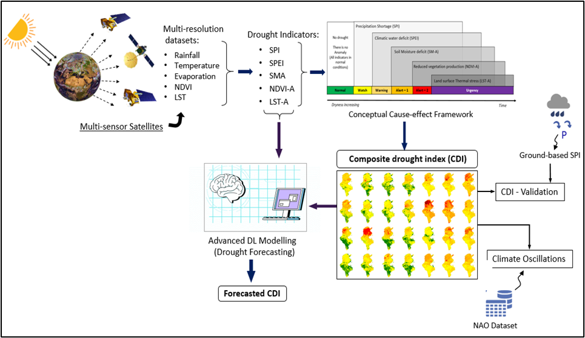

# CDI Project README

## Project Overview
This project develops a novel CDI using multi-source Earth Observation data (CHIRPS, ERA5-Land, MODIS) at 1 km resolution. It integrates SPI, SPEI, soil moisture anomaly (SMA), NDVI anomaly, and LST anomaly via a logic-based cause-effect framework for drought monitoring and classifies into Normal, Watch, Warning, Alert-1/2, and Urgency stages.

Deep learning forecasts CDI using 12 models (e.g., TimeFormer, SSSLN, LSTM), with TimeFormer performing best (Accuracy: 0.9057).

<div align="center">

</div>

## Key Features
- High-resolution (1 km) national drought dataset for Tunisia 2000-2025.
- Captures major events (e.g., 2000-2002, 2016-2018, 2021-2025 droughts).
- Validated against ground stations (R²=0.75 for SPI).
- Designed for reproducibility, extensibility, and transferability to other regions.

## Data Sources
| Product | Variables | Resolution | Period | Source |
|---------|-----------|------------|--------|--------|
| CHIRPS | Rainfall (SPI) | 5 km | 1981-present | UCSB Climate Hazards Center  |
| ERA5-Land | Temp, Evap, Soil Moisture (SPEI, SMA) | 9 km | 1981-present | Copernicus CDS |
| MODIS | LST (MOD11A1), NDVI (MOD13A3) | 1 km | 2000-present | NASA LP DAAC  |

Data harmonized to 1 km monthly scale via clipping, re-projection, and gap-filling.

## Methods
1. Compute indicators: SPI-1 (gamma dist.), SPEI-1 (log-logistic), z-scores for SMA/NDVI-A/LST-A.
2. CDI logic: Thresholds (e.g., SPI/SPEI/SMA/NDVI ≤ -1; LST-A ≥ 0.5).
3. Forecasting: Train/test 12 DL models on CDI time-series (train: 2000-2016; test: 2024-2025).
4. Validation: Wavelet analysis, ground SPI correlation.

## Installation
- Python environment with PyTorch/TensorFlow, Google Earth Engine.
- Public datasets downloadable via APIs (CHIRPS, ERA5, MODIS).

## Usage
Run scripts for data processing, CDI computation, and forecasting. 


## Repository
Source code, scripts, and CDI dataset on GitHub (as stated in paper).

## Authors and Funding
- Funded: SmartSDG-Tunisia (Ministry of Higher Education).

## Citation

If you use this repository, please cite:

```bibtex
@article{paper,
  title={A Novel Composite Drought Index from Satellite Imagery and Its Forecasting using Deep Learning Models : Case Study for Tunisia 2000-2025},
  author={Ben Othmen Dhouha, Oueslati Fedi, Chouikhi Farah, Ben Abbes Ali, Rhif Manel, Baltin Hanen, Farah Mohamed and Farah Imed Riadh},
  year={2026}
}
```

## Contact
For questions or collaboration, please contact:

- **Name:** [Pr. Riadh Farah]
- **Email:** [recherche@mse.uma.tn]
